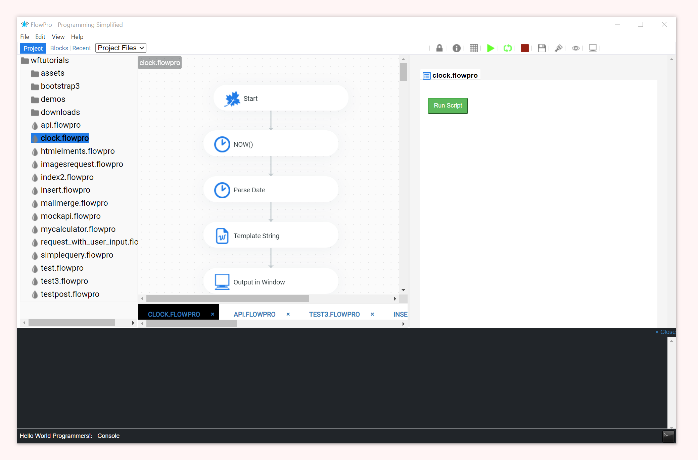

# FlowPro
Welcome to a different way to code. Learn more [here](https://wynton-franklin.gitbook.io/flowpro-docs/)

Visit the [releases](https://github.com/wyntonfranklin/flowpro/releases) page for downloads.

## About FlowPro
FlowPro is a graphic programming tool that allows you to create reusable and shareable scripts across various platforms. Build simple or complex scripts with the simple to use graphical interface

With FlowPro you can do many of your programming or scripting tasks. 
You can connect to databases and send files via email. You can upload files to FTP servers and download files from the internet. You can connect to an API endpoint and modify the connect returned. You can post to a form or make a get request. FlowPro can do a lot and more is planned.

