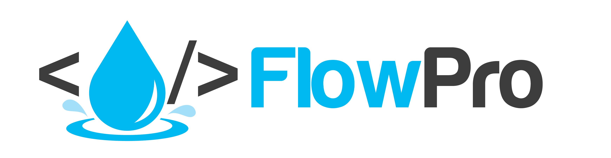
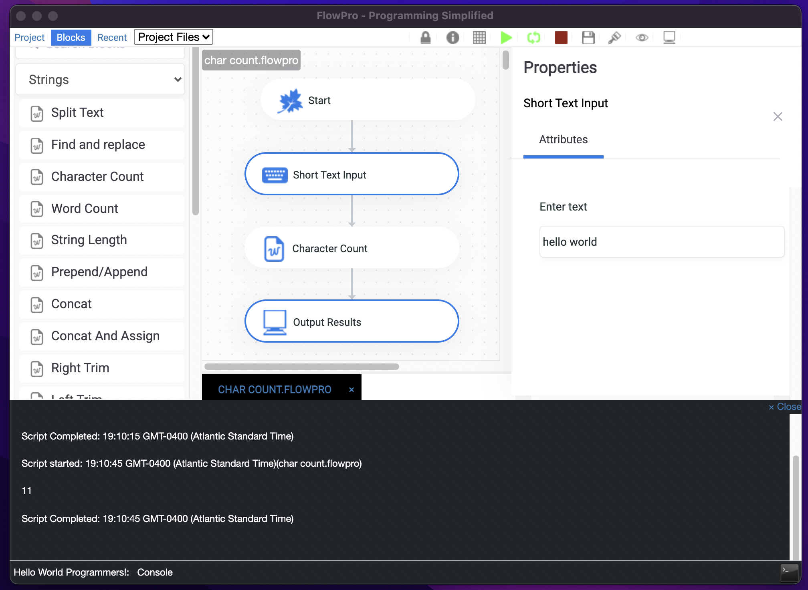

# FlowPro

 

Welcome to a different way to code. Learn more [here](https://wynton-franklin.gitbook.io/flowpro-docs/)

Visit the [releases](https://github.com/wyntonfranklin/flowpro/releases) page for downloads.

## About FlowPro
FlowPro is a graphic programming tool that allows you to create reusable and shareable scripts across various platforms. Build simple or complex scripts with the simple to use graphical interface

With FlowPro you can do many of your programming or scripting tasks. 
You can connect to databases and send files via email. You can upload files to FTP servers and download files from the internet. You can connect to an API endpoint and modify the connect returned. You can post to a form or make a get request. FlowPro can do a lot and more is planned.

## Features

* Graphical Editing
* Rename blocks
* Over 50 different function blocks
* Form Builder
* Console view
* Save a block as favorites
* Run script in a repeating loop
* Environment Variables
* Autosave
* Export feature
* Window display
* Include multiple different scripts

## Installation

### For Windows
Download from Windows store [here](https://www.microsoft.com/store/apps/9P350WJPQH84) or 
head to the release page and download and extract the installation file.
The application will open once installation is complete.

### For Linux
View the release page for different versions.

Once installed head to the releases page and download the app image.

### For Mac
Head to the release page [here](https://github.com/wyntonfranklin/flowpro/releases/tag/1.0.0-mac). 
Select the pkg version. Others will be made available.

## Getting Started

To get started hit the File Menu and choose New FlowPro option give your script a name and get started adding blocks. Its that simple.
Start playing around with the blocks.

## Running a Script

To run a script you can right-click on the canvas and press run. Or you can press the play button.
To stop the script press the red stop button. As many times as you need to.

## Building Forms
To build a script with form elements right click and press build form. Forms are automatically built when a new file is selected
or a tab is clicked on.

## Resources / Built With

* Electron
* Bootstrap 3
* Flowy ([https://github.com/alyssaxuu/flowy](https://github.com/alyssaxuu/flowy))
* And a lot of other NPM Packages for special features

## NPM Resources

For your reference. Used for blocks with similar functionality.

* fast-xml-parser
* ftp
* json-as-xlsx
* mssql
* mysql
* nodemailer
* read-excel-file
* sqlite
* sqlite3
* ssh2-sftp-client

## Special Links

* Documentation - [https://wynton-franklin.gitbook.io/flowpro-docs/](https://wynton-franklin.gitbook.io/flowpro-docs/)
* Releases - [https://github.com/wyntonfranklin/flowpro/releases](https://github.com/wyntonfranklin/flowpro/releases)
* Tutorials - Check out the Youtube playlist [here](https://www.youtube.com/watch?v=J7ulDQUnM6E&list=PLWdSdbV1ysPxp2usbSOvtXWaLpEPIxtXe&ab_channel=wfTutorials)

